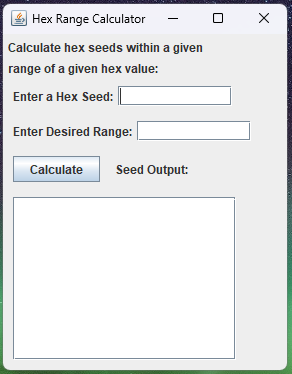
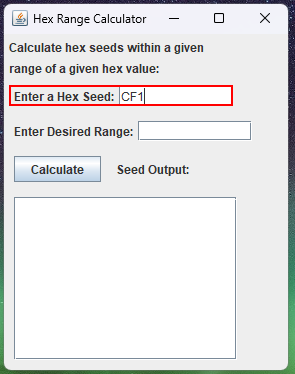
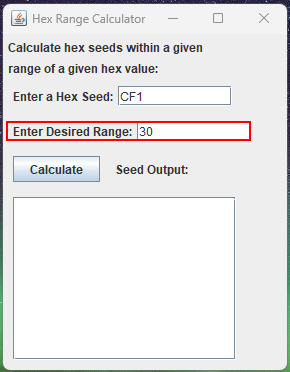
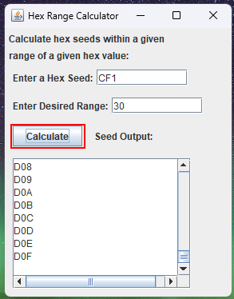
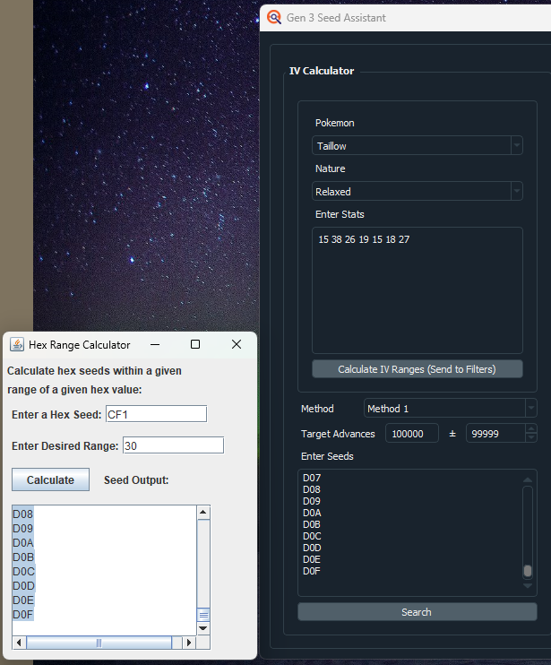
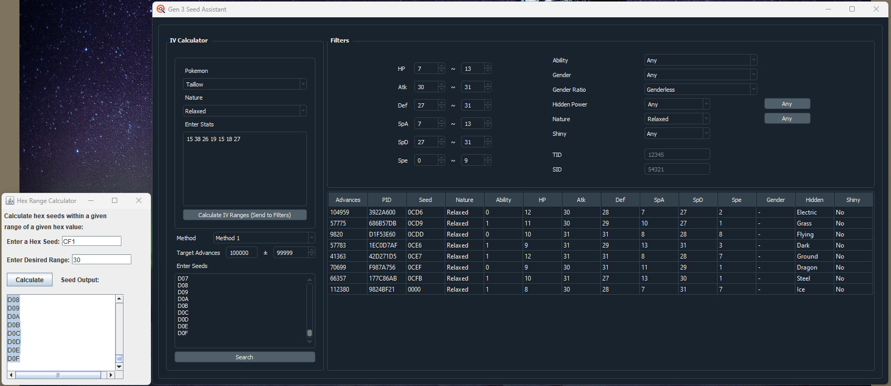

# SeedGenerator

SeedGenerator is a simple, standalone program written entirely in java that generates a range of hexadecimal "seeds."

This generator is intended for use while performing RNG manipulation in Pokemon games. Specifically, it is useful during the trial-and-error step of finding your 4-digit hexadecimal seed. It is designed to be used in conjunction with another program that requires a set of hex seeds to check your encounter.

### Demo:

Open the program

Enter your target seed

Enter the desired range (note that the generator will produce _2n+1_ seeds where _n_ is the number entered in this field)

_Calculate!_

Open Gen 3 Seed Assistant and copy the output to the 
"Enter Seeds" field.

_Calculate_

